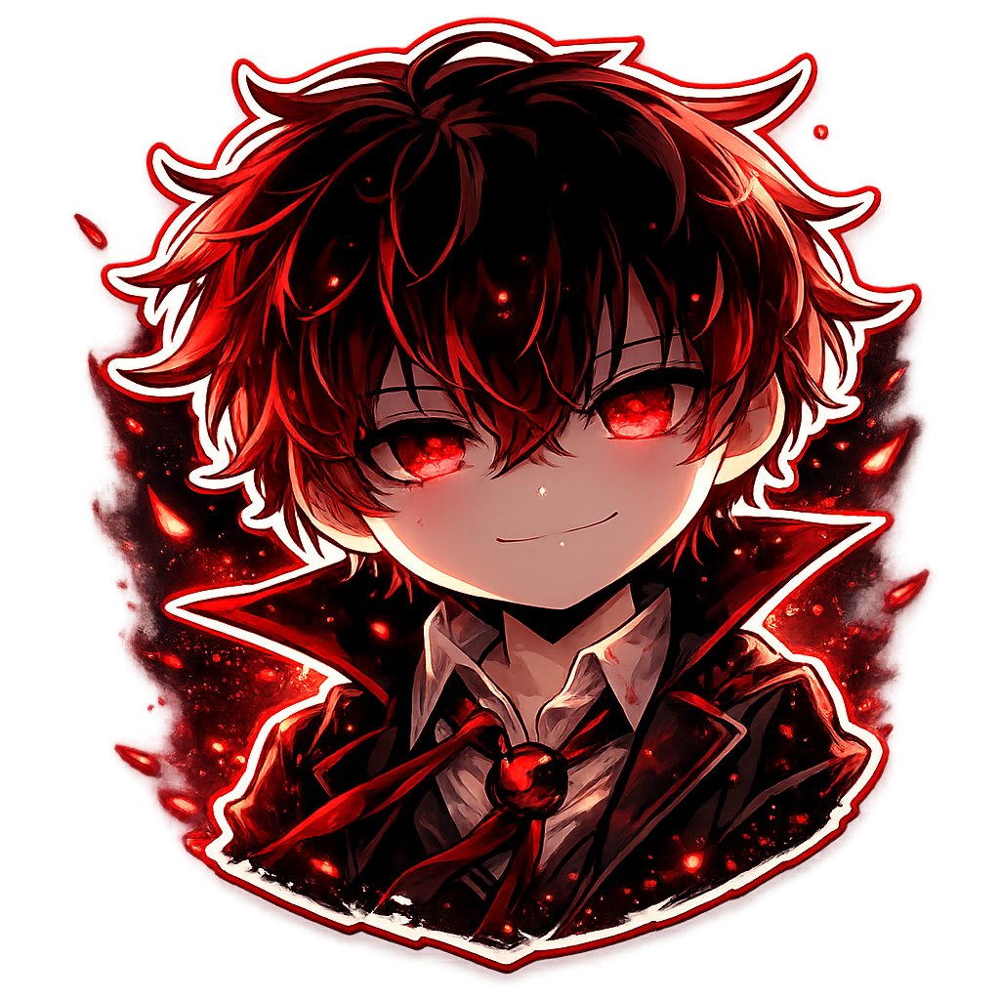

# Discord Custom RPC Manager

<p align="center">
  
</p>

<p align="center">
  <strong>A fully-featured Discord Rich Presence Manager</strong><br>
  Open source, free for everyone, built with Electron + React + TypeScript
</p>

<p align="center">
  <a href="https://github.com/XSaitoKungX/Discord-CustomRPC/releases"></a>
  <a href="LICENSE"></a>
  
</p>

---

## Features

- **Profile Management** — Create, edit, and organize multiple RPC profiles
- **Live Preview** — See exactly how your presence will look in Discord before activating
- **Auto-Complete Assets** — Automatically fetches your Discord app's Rich Presence assets with thumbnails
- **System Tray** — Minimize to tray and run in the background
- **Deep Link Support** — Import profiles via `dcrpc://` protocol
- **Cross-Platform** — Available for Windows, macOS, and Linux
- **Modern UI** — Clean, responsive interface with dark/light theme support

---

## Download

Get the latest release from the [Releases](https://github.com/XSaitoKungX/Discord-CustomRPC/releases) page.

| Platform | Download |
|----------|----------|
| Windows | `.exe` (Installer) or `.portable.exe` (No install) |
| Linux | `.AppImage` (Portable) or `.deb` (Debian/Ubuntu) |
| macOS | `.dmg` (Disk Image) |

---

## Quick Start

1. **Download** and install the app for your platform
2. **Create a Discord Application** (if you don't have one):
   - Go to [Discord Developer Portal](https://discord.com/developers/applications)
   - Click "New Application", give it a name
   - Copy the **Application ID** (you'll need it)
   - Go to Rich Presence → Art Assets and upload your images
3. **Create a Profile** in the app with your Application ID
4. **Select your assets** from the auto-complete dropdown
5. **Activate** the RPC — your Discord status will update immediately

---

## Windows 11 SmartScreen Warning

> ⚠️ **Important for Windows users**

When running the installer or portable version on Windows 10/11, you may see a **Windows SmartScreen** warning:

> "Windows protected your PC" / "Microsoft Defender SmartScreen prevented an unrecognized app from starting"

### Why this happens

This app is **not code-signed** (code signing certificates cost $200-400/year). Windows flags all unsigned executables as potentially suspicious — this is normal for open-source projects.

### How to run anyway

1. Click **"More info"** on the SmartScreen dialog
2. Click **"Run anyway"**

Alternatively, right-click the `.exe` → **Properties** → Check **"Unblock"** at the bottom → **Apply**

The app is completely safe — it's open source, you can inspect every line of code in this repository.

---

## Building from Source

### Prerequisites

- [Bun](https://bun.sh/) (recommended) or Node.js 20+
- Git

### Clone & Install

```bash
git clone https://github.com/XSaitoKungX/Discord-CustomRPC.git
cd Discord-CustomRPC
bun install
```

### Development

```bash
bun run dev
```

### Build for Production

```bash
# Build for current platform
bun run build:full

# Platform-specific builds
bun run build:win      # Windows
bun run build:linux    # Linux
bun run build:mac      # macOS
```

Output will be in the `dist/` directory.

---

## Troubleshooting

### Images show "404" in preview but work in Discord

This is a **Discord CDN caching delay**, not a bug. Newly uploaded assets take 5-30 minutes to become accessible via Discord's CDN. The images will work in your actual Discord client even if the preview shows 404.

### "Application ID is invalid" error

- Make sure you copied the correct Application ID from the [Discord Developer Portal](https://discord.com/developers/applications)
- It should be a long number (e.g., `1216403632283582496`)
- Do not use the Client Secret or Public Key

### RPC not showing in Discord

1. Make sure Discord is running
2. Check that your Application ID is correct
3. Try clicking "Stop" and then "Start" again
4. Ensure you don't have another RPC app running

### Linux: AppImage won't run

Make it executable:
```bash
chmod +x Discord\ Custom\ RPC\ Manager-*.AppImage
```

---

## Tech Stack

- **Frontend**: React 19, TypeScript, Tailwind CSS, Radix UI
- **Backend**: Electron, better-sqlite3, drizzle-orm
- **Build**: electron-vite, electron-builder
- **Package Manager**: Bun

---

## Contributing

Contributions are welcome! Please feel free to submit a Pull Request.

1. Fork the repository
2. Create your feature branch (`git checkout -b feature/AmazingFeature`)
3. Commit your changes (`git commit -m 'Add some AmazingFeature'`)
4. Push to the branch (`git push origin feature/AmazingFeature`)
5. Open a Pull Request

---

## License

This project is licensed under the MIT License — see the [LICENSE](LICENSE) file for details.

---

## Author

**XSaitoKungX** — [xsaitox.dev](https://xsaitox.dev)

<p align="center">
  Made with ❤️ for the Discord community
</p>
